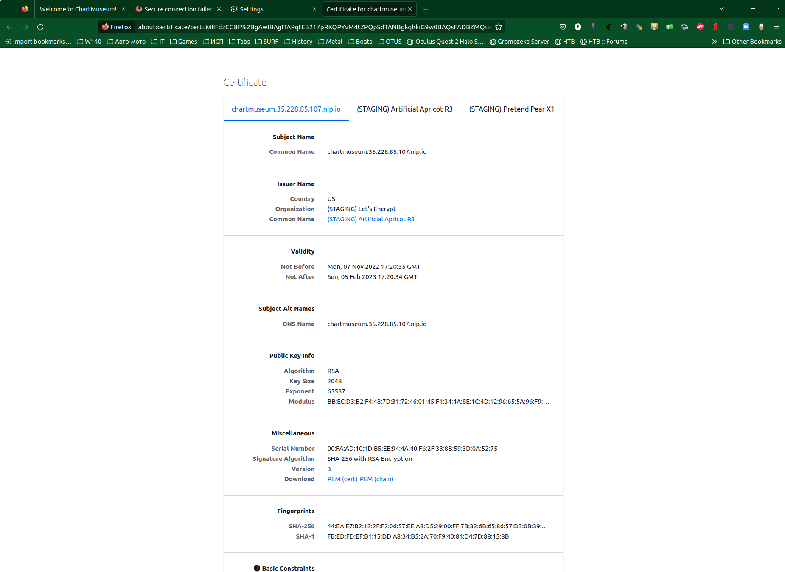

<H1>ДЗ день 7</H1>

<H2>GCP Config </H2>
curl -O https://dl.google.com/dl/cloudsdk/channels/rapid/downloads/google-cloud-cli-406.0.0-linux-x86_64.tar.gz
tar -xf google-cloud-cli-406.0.0-linux-x86_64.tar.gz

gcloud components install gke-gcloud-auth-plugin
gke-gcloud-auth-plugin --version
gcloud container clusters get-credentials otus-cluster --zone europe-north1-a --project otus-367913
kubectl get nodes
NAME                                          STATUS   ROLES    AGE    VERSION
gke-otus-cluster-default-pool-795c999d-bljt   Ready    <none>   111s   v1.23.8-gke.1900
gke-otus-cluster-default-pool-795c999d-h2v2   Ready    <none>   110s   v1.23.8-gke.1900
gke-otus-cluster-default-pool-795c999d-kw4j   Ready    <none>   111s   v1.23.8-gke.1900

<H2>Helm Config</H2>

curl -O https://get.helm.sh/helm-v3.10.1-linux-amd64.tar.gz
tar -xf helm-v3.10.1-linux-amd64.tar.gz
sudo mv helm /usr/local/bin/

helm repo add stable https://kubernetes-charts.storage.googleapis.com
Error: repo "https://kubernetes-charts.storage.googleapis.com" is no longer available; try "https://charts.helm.sh/stable" instead
helm repo add stable https://charts.helm.sh/stable
helm repo list
NAME    URL                          
stable  https://charts.helm.sh/stable

<H2>nginx-ingress</H2>
kubectl create ns nginx-ingress

Добавляем репу
<pre><code>
helm repo add ingress-nginx https://kubernetes.github.io/ingress-nginx
helm repo update
</pre></code>

Смотрим что получилось
<pre><code>
helm search repo ingress-nginx
NAME                            CHART VERSION   APP VERSION     DESCRIPTION                                       
nginx-stable/nginx-ingress      0.15.1          2.4.1           NGINX Ingress Controller
</pre></code>

Установка
<pre><code>
helm install --debug  nginx-ingress ingress-nginx/ingress-nginx --wait --create-namespace --namespace=nginx-ingress --version=4.3.0
</pre></code>

В итоге
<pre><code>
kubectl get svc -n nginx-ingress
NAME                                               TYPE           CLUSTER-IP    EXTERNAL-IP     PORT(S)                      AGE
nginx-ingress-ingress-nginx-controller             LoadBalancer   10.64.9.184   35.228.85.107   80:32637/TCP,443:30056/TCP   2m15s
nginx-ingress-ingress-nginx-controller-admission   ClusterIP      10.64.3.208   <none>          443/TCP                      2m15s
</pre></code>
Готово

<H2>cert-manager</H2>

<pre><code>
helm repo add jetstack https://charts.jetstack.io
helm repo update
</pre></code>

Устанавливаем CDR
<pre><code>
kubectl apply -f https://github.com/cert-manager/cert-manager/releases/download/v1.10.0/cert-manager.crds.yaml
</pre></code>

Устанавливаем cert-manager 1.10.0
<pre><code>
kubectl create ns cert-manager
helm install cert-manager jetstack/cert-manager --namespace cert-manager --create-namespace --version v1.10.0 
</pre></code>

Итого
<pre><code>
kubectl get pods -n cert-manager
NAME                                       READY   STATUS    RESTARTS   AGE
cert-manager-66dbc9658d-4b92f              1/1     Running   0          60s
cert-manager-cainjector-69cfd4dbc9-c8vww   1/1     Running   0          60s
cert-manager-webhook-5f454c484c-qh5d8      1/1     Running   0          60s
</pre></code>

Добавляем ClusterIssuer
<pre><code>
kubectl apply -f cert-manager/ClusterIssuer.yaml
</pre></code>

Ошибок нет, продолжаем....

<H2>chartmuseum</H2>

Добавляем Репу
<pre><code>
kubectl create ns chartmuseum
kubectl apply -f chartmuseum/secret.yaml
</pre></code>

Установка
<pre><code>
helm repo add chartmuseum https://chartmuseum.github.io/charts
helm install --debug --wait my-chartmuseum chartmuseum/chartmuseum --version 3.9.1 --namespace=chartmuseum -f chartmuseum/values.yaml
</pre></code>

В результате имеем
<pre><code>
kubectl get pods -n cert-manager
NAME                                       READY   STATUS    RESTARTS   AGE
cert-manager-66dbc9658d-4b92f              1/1     Running   0          3m38s
cert-manager-cainjector-69cfd4dbc9-c8vww   1/1     Running   0          3m38s
cert-manager-webhook-5f454c484c-qh5d8      1/1     Running   0          3m38s

kubectl get svc -n cert-manager
NAME                   TYPE        CLUSTER-IP     EXTERNAL-IP   PORT(S)    AGE
cert-manager           ClusterIP   10.64.15.249   <none>        9402/TCP   3m46s
cert-manager-webhook   ClusterIP   10.64.15.250   <none>        443/TCP    3m46s

kubectl get ingress -A
NAMESPACE     NAME             CLASS    HOSTS                              ADDRESS         PORTS     AGE
chartmuseum   my-chartmuseum   <none>   chartmuseum.35.228.85.107.nip.io   35.228.85.107   80, 443   9m36s
</pre></code>

Тест
curl -к -vvv https://chartmuseum.35.228.85.107.nip.io
HTTP/2 200 

Странно конечно что никто не доверяет Staging сертификатам. Ну да ладно.

Зачистка
<pre><code>
helm uninstall my-chartmuseum --namespace=chartmuseum
</pre></code>

<H2>harbor</H2>

Ну теперь тут мы как дома. Добавляем Репу, обновляемся и устанавливаем

<pre><code>
helm repo add harbor https://helm.goharbor.io
helm repo update
kubectl create ns harbor
helm install --debug --wait my-harbor harbor/harbor --version 1.10.1 --namespace=harbor -f harbor/values.yaml
</pre></code>

И того
<pre><code>
kubectl get svc -A
NAMESPACE       NAME                                               TYPE           CLUSTER-IP     EXTERNAL-IP     PORT(S)                      AGE
cert-manager    cert-manager                                       ClusterIP      10.64.15.249   <none>          9402/TCP                     52m
cert-manager    cert-manager-webhook                               ClusterIP      10.64.15.250   <none>          443/TCP                      52m
default         kubernetes                                         ClusterIP      10.64.0.1      <none>          443/TCP                      66m
harbor          harbor                                             LoadBalancer   10.64.13.240   34.88.78.13     80:31867/TCP,443:32603/TCP   2m17s
harbor          my-harbor-chartmuseum                              ClusterIP      10.64.3.217    <none>          80/TCP                       2m17s
harbor          my-harbor-core                                     ClusterIP      10.64.13.253   <none>          80/TCP                       2m17s
harbor          my-harbor-database                                 ClusterIP      10.64.10.92    <none>          5432/TCP                     2m17s
harbor          my-harbor-jobservice                               ClusterIP      10.64.12.127   <none>          80/TCP                       2m17s
harbor          my-harbor-portal                                   ClusterIP      10.64.10.241   <none>          80/TCP                       2m17s
harbor          my-harbor-redis                                    ClusterIP      10.64.0.211    <none>          6379/TCP                     2m17s
harbor          my-harbor-registry                                 ClusterIP      10.64.3.140    <none>          5000/TCP,8080/TCP            2m17s
harbor          my-harbor-trivy                                    ClusterIP      10.64.5.66     <none>          8080/TCP                     2m17s
kube-system     default-http-backend                               NodePort       10.64.10.194   <none>          80:30282/TCP                 65m
kube-system     kube-dns                                           ClusterIP      10.64.0.10     <none>          53/UDP,53/TCP                65m
kube-system     metrics-server                                     ClusterIP      10.64.4.198    <none>          443/TCP                      65m
nginx-ingress   nginx-ingress-ingress-nginx-controller             LoadBalancer   10.64.9.184    35.228.85.107   80:32637/TCP,443:30056/TCP   56m
nginx-ingress   nginx-ingress-ingress-nginx-controller-admission   ClusterIP      10.64.3.208    <none>          443/TCP                      56m

</pre></code>

helm uninstall --debug --wait my-harbor --namespace=harbor

curl -vvv https://34.88.78.13

Зачистка
<pre><code>
helm uninstall --debug --wait my-harbor --namespace=harbor
</pre></code>

<H2>hipster-shop</H2>

kubectl create ns hipster-shop
helm upgrade --install hipster-shop hipster-shop --namespace hipster-shop

gcloud container clusters get-credentials otus-cluster --zone europe-north1-a --project otus-367913 \
 && kubectl port-forward --namespace hipster-shop $(kubectl get pod --namespace hipster-shop --selector="app=frontend" --output jsonpath='{.items[0].metadata.name}') 8080:8080

Идём по адресу http://localhost:8080 и попадаем в наш магазин.

Затюнили не много values.yaml и темплейты перезапускаем

kubectl delete deployment frontend -n hipster-shop
kubectl delete svc frontend -n hipster-shop
kubectl delete ingress frontend -n hipster-shop
helm upgrade --install frontend frontend --namespace hipster-shop

И привет, у нас появился ингресс и мы видим наш магазин на прямую в браузере по адресу http://shop.35.228.85.107.nip.io/

helm upgrade --install hipster-shop hipster-shop --namespace hipster-shop --set frontend.service.NodePort=31234

Удаляем всё лишнее. 
helm uninstall hipster-shop --namespace hipster-shop

